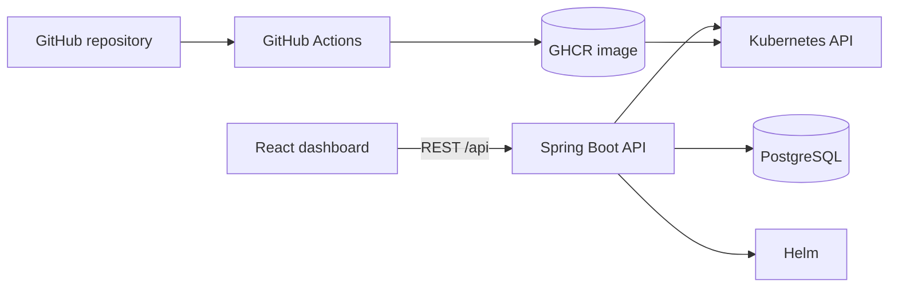

# DeployKit

A self-service internal developer platform: point it at a GitHub repository, and DeployKit deploys the app to
Kubernetes, with deployment history, logs and rollback.

> **Status: Phase 8 of 12 complete.** You can create projects, deploy them to Kubernetes through Helm, follow each
> deployment's history, read its logs and roll a deployment back from the dashboard. Authentication and AWS come next
> (see the [Roadmap](#roadmap)). There is **no authentication yet**: do not expose the API.

## How it works

A developer creates a project (GitHub repository, branch, port) and clicks **Deploy**. The repository's own GitHub
Actions pipeline has already built and published the image; DeployKit deploys it with Helm, watches the rollout and
records what happened.



The backend is a modular monolith (`controller → service → repository → domain`); see
[docs/architecture.md](docs/architecture.md).

## Technology

| Area | Choice |
|---|---|
| Backend | Java 21, Spring Boot 3.5, Maven, PostgreSQL 16 + Flyway |
| Frontend | React 19, TypeScript, Vite, Tailwind CSS 4, React Router, TanStack Query, Axios |
| Kubernetes | Fabric8 client, one generic Helm chart, kind for local clusters |
| CI/CD | GitHub Actions, GitHub Container Registry |
| Local infrastructure | Docker Compose |

The reasons behind these choices are recorded in [docs/adr](docs/adr).

## Quick start

Prerequisites: Docker, Node 20.19+ and JDK 21.

```bash
cp .env.example .env                    # then set POSTGRES_PASSWORD (.env is gitignored)
docker compose up -d postgres
cd backend && SPRING_PROFILES_ACTIVE=local ./mvnw spring-boot:run     # API on :8080, Flyway migrates on startup
cd frontend && npm install && npm run dev                             # dashboard on http://localhost:5173
```

Check it works: `curl localhost:8080/api/health` returns `{"status":"UP"}`, and the dashboard header shows
"Backend UP". Without a local JDK 21, `docker compose --profile full up --build` runs the backend in a container, but
it cannot deploy (no Helm or kubeconfig inside).

The Compose ports are bound to `127.0.0.1`, so nothing is reachable from the network.

**To deploy an application** you also need a cluster, `helm` and `kubectl`:
[docs/local-kubernetes.md](docs/local-kubernetes.md) sets up a local kind cluster in a few commands.

## Documentation

| Topic | Where |
|---|---|
| Endpoints, history and logs | [docs/api.md](docs/api.md) |
| How a deployment runs (states, rollout, limits) | [docs/deployment-engine.md](docs/deployment-engine.md) |
| Architecture and data model | [docs/architecture.md](docs/architecture.md) |
| Architecture decisions | [docs/adr](docs/adr) |
| Build pipeline, tags and secrets (CI/CD) | [docs/github-actions.md](docs/github-actions.md) |
| Configuration and environment variables | [docs/configuration.md](docs/configuration.md) |
| Local Kubernetes and the Helm chart | [docs/local-kubernetes.md](docs/local-kubernetes.md) |
| Running the tests | [docs/testing.md](docs/testing.md) |
| Troubleshooting | [docs/troubleshooting.md](docs/troubleshooting.md) |

## Repository layout

```
backend/         Spring Boot API (Maven)
frontend/        React + Vite dashboard
helm/            Generic Helm chart used to deploy applications
infrastructure/  Local kind cluster config (Terraform for AWS in Phase 12)
.github/         GitHub Actions: CI and the reusable image pipeline
docs/            Documentation and architecture decisions
docker-compose.yml
```

## Roadmap

1. ~~Foundation~~
2. ~~Project management API + UI~~
3. ~~Kubernetes integration + Helm chart~~
4. ~~Deployment engine~~
5. ~~GitHub Actions build pipeline~~
6. ~~Deployment history~~
7. ~~Logs~~
8. ~~Rollback~~
9. Authentication (JWT, USER/ADMIN)
10. Testing (Testcontainers, Vitest, Playwright)
11. Observability (Prometheus, Grafana, OpenTelemetry)
12. AWS (Terraform: VPC, EKS, ECR, RDS, IAM)
