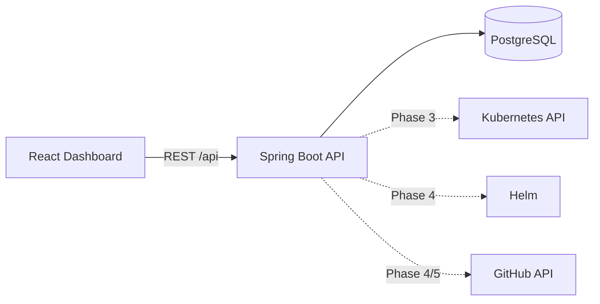

# DeployKit

A self-service internal developer platform: point it at a GitHub repository, and DeployKit builds, ships and
runs the app on Kubernetes, with deployment history, logs and rollback.

> **Status: Phase 3 (Kubernetes integration) complete.** Projects can be managed from the API and dashboard, a local
> kind cluster and a generic Helm chart exist, and the backend has a `KubernetesService` (create/update deployments,
> status, pods, logs). The deployment engine, auth and AWS come in later phases (see [Roadmap](#roadmap)).

## API

| Method | Path | Success | Errors |
|---|---|---|---|
| `GET` | `/api/health` | 200 `{"status":"UP"}` | |
| `POST` | `/api/projects` | 201 + `Location` | 400 validation (`errors` per field), 409 duplicate name |
| `GET` | `/api/projects` | 200, newest first | |
| `GET` | `/api/projects/{id}` | 200 | 400 malformed id, 404 |
| `DELETE` | `/api/projects/{id}` | 204 | 400 malformed id, 404 |

`POST /api/projects` body: `name` (required, ≤100, unique), `repositoryUrl` (required, `https://github.com/owner/repo`),
`branch` (optional, defaults to `main`), `port` (required, 1-65535). Errors are RFC 7807 `application/problem+json`.

## Architecture



The backend is a **modular monolith** with layered packages under `com.deploykit`:
`controller → service → repository → domain`, plus `dto`, `mapper`, `exception`, `configuration`.
More detail: [docs/architecture.md](docs/architecture.md).

## Technology choices

| Area | Choice | Why |
|---|---|---|
| Backend | Java 21, Spring Boot 3.5, Maven | Mature, well-known stack for platform tooling |
| Database | PostgreSQL 16 + Flyway | Versioned migrations; Hibernate only *validates* the schema |
| Frontend | React 19, TypeScript, Vite, Tailwind CSS 4, React Router, TanStack Query, Axios | Feature-oriented structure, server state in TanStack Query |
| Kubernetes | Fabric8 client, Helm chart, kind (local) | Fluent client API; one generic chart for every app |
| Local infra | Docker Compose | One command for Postgres |

Decisions are recorded in [docs/adr](docs/adr).

## Repository layout

```
backend/         Spring Boot API (Maven)
frontend/        React + Vite dashboard
infrastructure/  Terraform (Phase 12)
helm/            Helm charts (Phase 3)
.github/         Workflows (Phase 5)
docs/            Architecture notes and ADRs
docker-compose.yml
```

## Local setup

Prerequisites: Docker, Node 20.19+, and either JDK 21 (backend run natively) or just Docker.

### 1. Configuration

```bash
cp .env.example .env      # then set POSTGRES_PASSWORD
```

`.env` is gitignored. It is read by Docker Compose and by the backend `local` profile.

### 2. Run PostgreSQL

```bash
docker compose up -d postgres
```

### 3. Run the backend

Option A — JDK 21 installed:

```bash
cd backend
SPRING_PROFILES_ACTIVE=local ./mvnw spring-boot:run
```

Option B — containerised (uses the production `Dockerfile`, JSON logs):

```bash
docker compose --profile full up --build
```

Flyway applies the migrations on startup. Verify:

```bash
curl localhost:8080/api/health          # {"status":"UP"}
curl localhost:8080/actuator/health     # includes DB connectivity
```

### 4. Run the frontend

```bash
cd frontend
npm install
npm run dev                             # http://localhost:5173
```

The dev server proxies `/api` to `http://localhost:8080` (override with `VITE_API_PROXY_TARGET`,
see `frontend/.env.example`). The header shows the live backend status.

### 5. Run Kubernetes locally (kind)

```bash
brew install kind helm                  # or download the binaries; kubectl is also required
kind create cluster --config infrastructure/kind/kind-config.yaml   # context: kind-deploykit
kubectl get nodes
```

The backend uses your current kubeconfig context (or `deploykit.kubernetes.context` / `DEPLOYKIT_KUBERNETES_CONTEXT`
to pick one, e.g. `kind-deploykit`). The client connects lazily, so the backend still starts without a cluster.
Delete the cluster with `kind delete cluster --name deploykit`.

**Helm chart** (`helm/deploykit-app`) renders a Deployment, Service, Ingress (off by default), ConfigMap and Secret:

```bash
helm lint helm/deploykit-app
helm upgrade --install demo helm/deploykit-app -n demo --create-namespace \
  --set image.repository=nginx --set image.tag=1.27-alpine --set containerPort=80 \
  --set config.GREETING=hi --set-string secretEnv.API_KEY=change-me --wait
helm -n demo uninstall demo
```

Sensitive values go in `secretEnv` (or an existing Secret via `existingSecret`); never commit real values. The
chart labels pods with `app.kubernetes.io/name=<app name>`, the same label `KubernetesService` selects on.
The kind config maps ports 8081/8443 for an ingress controller, which is not installed by default.

## Configuration reference (backend)

| Variable | Used by | Purpose |
|---|---|---|
| `DB_URL`, `DB_USERNAME`, `DB_PASSWORD` | default profile / containers | JDBC connection. No defaults. |
| `POSTGRES_*` | `local` profile, Compose | From `.env`; `local` builds the JDBC URL from these |
| `SERVER_PORT` | all | Default `8080` |
| `LOG_LEVEL` | all | Level for `com.deploykit` (default `INFO`) |

Logging is structured (ECS JSON) by default and plain text under the `local` profile.

## Testing

```bash
cd backend && ./mvnw test                 # JDK 21
# or without a local JDK 21:
docker run --rm -v "$PWD/backend":/w -v deploykit-m2:/root/.m2 -w /w maven:3.9-eclipse-temurin-21 mvn -B test
cd frontend && npm run lint && npm run build
```

Backend tests cover the health controller, global exception handler, `ProjectService` (Mockito),
`ProjectController` (MockMvc: validation, 201/204/400/404/409) and `KubernetesService` (Fabric8 mock API server:
namespace, deployment shape, rollout status, pods, logs, error mapping).

`KubernetesServiceClusterTest` runs against a real cluster (server-side apply, rollout, scaling, pods, logs) and is
skipped unless enabled. With the kind cluster running:

```bash
cd backend && DEPLOYKIT_IT_K8S=true ./mvnw test -Dtest=KubernetesServiceClusterTest
```

Testcontainers integration tests, Vitest and Playwright come in Phase 10.

## Troubleshooting

- **`POSTGRES_PASSWORD` error from Compose:** create `.env` from `.env.example`.
- **Backend `Could not resolve placeholder 'DB_URL'`:** run with `SPRING_PROFILES_ACTIVE=local`, or export `DB_*`.
- **`Could not resolve placeholder 'POSTGRES_PASSWORD'` with `local`:** run from the `backend/` directory so `../.env` resolves.
- **Frontend shows "Backend unreachable":** the backend is not running on `:8080`.
- **Password changed but DB login fails:** the volume keeps the old password; `docker compose down -v` (deletes data).

## Roadmap

1. ~~Foundation~~
2. ~~Project management API + UI~~
3. ~~Kubernetes integration + Helm chart~~
4. Deployment engine
5. GitHub Actions build pipeline
6. Deployment history
7. Logs
8. Rollback
9. Authentication (JWT, USER/ADMIN)
10. Testing (Testcontainers, Vitest, Playwright)
11. Observability (Prometheus, Grafana, OpenTelemetry)
12. AWS (Terraform: VPC, EKS, ECR, RDS, IAM)

CI/CD architecture, deployment workflow, AWS/Terraform and observability sections will be added with their phases.
