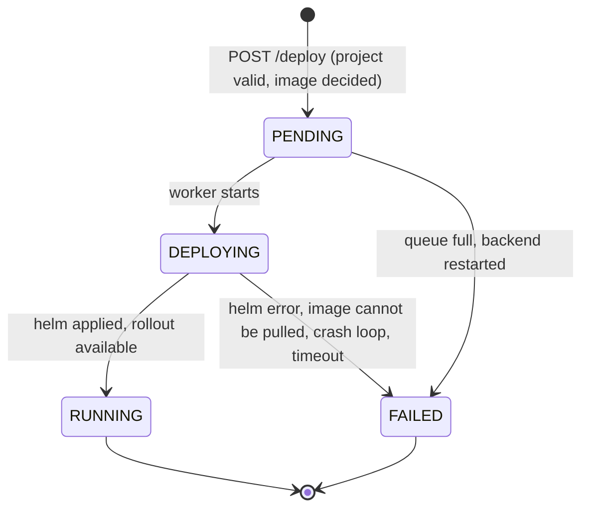
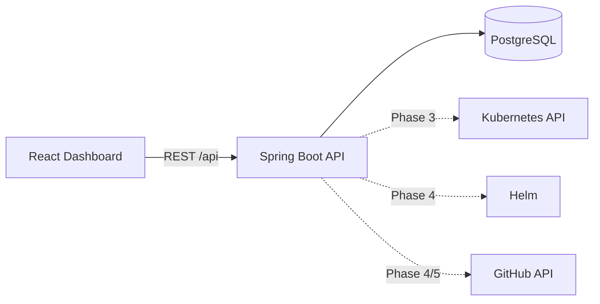
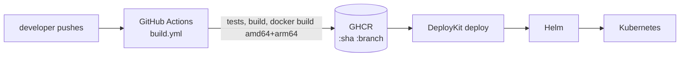

# DeployKit

A self-service internal developer platform: point it at a GitHub repository, and DeployKit builds, ships and
runs the app on Kubernetes, with deployment history, logs and rollback.

> **Status: Phase 7 (logs) complete.** A project can be deployed to Kubernetes through Helm from the API and the
> dashboard, a reusable GitHub Actions workflow builds and publishes the images DeployKit deploys, each project keeps a
> filterable deployment history, and the logs of a deployment are readable in a terminal-style view that refreshes
> itself. Rollback, auth and AWS come in later phases (see [Roadmap](#roadmap)).

## API

| Method | Path | Success | Errors |
|---|---|---|---|
| `GET` | `/api/health` | 200 `{"status":"UP"}` | |
| `POST` | `/api/projects` | 201 + `Location` | 400 validation (`errors` per field), 409 duplicate name |
| `GET` | `/api/projects` | 200, newest first | |
| `GET` | `/api/projects/{id}` | 200 | 400 malformed id, 404 |
| `DELETE` | `/api/projects/{id}` | 204, also deletes the project's Kubernetes namespace | 400 malformed id, 404, 409 deployment in progress |
| `POST` | `/api/projects/{id}/deploy` | 202 + `Location`, deployment `PENDING` | 400 invalid image, 404, 409 deployment already in progress, 503 queue full |
| `GET` | `/api/projects/{id}/deployments` | 200, one page, newest first | 400 malformed id or unknown status, 404 |
| `GET` | `/api/deployments/{id}` | 200 | 400 malformed id, 404 |
| `GET` | `/api/deployments/{id}/logs` | 200, pod logs and workflow events | 400 malformed id or non-numeric `tail`, 404 |

`POST /api/projects` body: `name` (required, ≤100, unique), `repositoryUrl` (required, `https://github.com/owner/repo`),
`branch` (optional, defaults to `main`), `port` (required, 1-65535). Errors are RFC 7807 `application/problem+json`.

`POST /api/projects/{id}/deploy` takes an optional body: `image` (full reference, e.g. `nginx:1.27-alpine`) or
`commitSha`. Without a body the image is `ghcr.io/<owner>/<repo>:<branch>`, which the [build pipeline](#cicd-architecture)
publishes, tagged with the commit SHA and the branch name.

### Deployment history

`GET /api/projects/{id}/deployments` returns a page, newest first:

```json
{ "content": [ { "id": "...", "version": 3, "status": "FAILED", "commitSha": null, "image": "ghcr.io/acme/app:main",
                 "createdAt": "...", "startedAt": "...", "finishedAt": "...", "errorMessage": "Pod ... is ErrImagePull" } ],
  "page": 0, "size": 20, "totalElements": 3, "totalPages": 1 }
```

- **Filter:** `?status=FAILED`, repeatable (`?status=FAILED&status=RUNNING`). An unknown status is a `400`.
- **Paging:** `page` (zero-based, default 0) and `size` (default 20, at most 100; larger values are capped). The sort is
  fixed, clients cannot choose it.
- **`version`** is the per-project deployment number (1, 2, 3, ...), stored in the database (migration V3), so it never
  changes. Rollbacks (Phase 8) will get their own number.
- **`commitSha`** is recorded when the deploy request names it, or when the image tag is itself a commit SHA (which
  is what the build pipeline produces). Deploying a branch-tagged image leaves it empty: DeployKit cannot know which
  commit a moving tag points to without asking GitHub.
- The **duration** is `finishedAt - startedAt`, computed by the dashboard.

The project page shows the history as a table (version, commit, status, created, duration, image, failure reason) with a
status filter and pagination, and refreshes itself every 3 seconds while a deployment is in flight.

### Deployment logs

`GET /api/deployments/{id}/logs?tail=200&previous=false` returns everything worth reading about a deployment:

```json
{ "deploymentId": "...", "status": "RUNNING",
  "pods": [ { "pod": "app-7d9f-x2", "phase": "Running", "ready": true, "restarts": 0, "reason": null,
              "log": "last lines of the container output...", "error": null } ],
  "podsNote": null,
  "events": [ { "timestamp": "2026-09-20T10:00:00Z", "level": "INFO", "message": "Deployment queued for image ..." } ] }
```

- **`pods`** are the Kubernetes pods of the application that run **this deployment's image**, with the last `tail` lines
  of their output (default 200, at most 5000). A pod that cannot give its logs (image still being pulled, or unable to
  be pulled) is reported with an `error` instead of failing the whole request.
- **`previous=true`** reads the previous container of each pod, which is what explains a `CrashLoopBackOff`.
- **`podsNote`** says why `pods` is empty: the deployment has not started, a newer deployment replaced its pods,
  the project was never deployed, or Kubernetes is unreachable. Pods only exist while their image is running, so the
  logs of an old deployment are gone once a newer one replaced it.
- **`events`** are the steps of the deployment workflow stored in `deployment_logs` (Helm output, rollout progress,
  failure reason, up to 1000 entries, oldest first). They stay available after the pods are gone and are the place to
  look when a deployment `FAILED` before its containers ever started.

On the project page, the **View** button of a history row opens its logs in a dark terminal with two tabs,
*Application* and *Deployment*. It refreshes every 3 seconds (a checkbox turns it off), follows the end of the output
like `tail -f`, and stops following while you scroll up to read. Until a row is chosen it shows the newest deployment.

## Deployment workflow

The request returns immediately (`202`) and a dedicated executor runs the workflow; follow it with
`GET /api/deployments/{id}` (the dashboard polls it).



`BUILDING` and `ROLLED_BACK` (Phase 8) exist in the schema but are not produced yet: images are built by GitHub
Actions in the application's own repository, not by DeployKit.

1. **Validate** the project and **decide the image** (request override, otherwise derived from the repository).
2. **Record** a `PENDING` deployment. One deployment per project may be in flight at a time (`409` otherwise,
   enforced by a partial unique index).
3. **Deploy**: create the namespace `dk-<project>-<id>`, then `helm upgrade --install` with the chart in `helm/deploykit-app`.
4. **Monitor the rollout** through the Kubernetes API. A pod stuck in `ImagePullBackOff`, `CrashLoopBackOff`, ... for
   30 s fails the deployment right away instead of waiting for the 5 minute timeout.
5. **Store** every step in `deployment_logs` and set the final status, `started_at`, `finished_at` and `error_message`.

A failed rollout leaves the previous version running (rolling update). On startup, deployments left in flight by a
previous run are marked `FAILED`.

Limits of this phase: the deployment engine assumes a **single backend instance**, and it needs the `helm` binary and
a kubeconfig, so deploy from a backend run natively (see below), not from the `full` Docker Compose profile.
Private registries (image pull secrets) are not supported yet.

## Architecture



The backend is a **modular monolith** with layered packages under `com.deploykit`:
`controller → service → repository → domain`, plus `dto`, `mapper`, `exception`, `configuration`.
More detail: [docs/architecture.md](docs/architecture.md).

## Technology choices

| Area | Choice | Why |
|---|---|---|
| Backend | Java 21, Spring Boot 3.5, Maven | Mature, well-known stack for platform tooling |
| Database | PostgreSQL 16 + Flyway | Versioned migrations; Hibernate only *validates* the schema |
| Frontend | React 19, TypeScript, Vite, Tailwind CSS 4, React Router, TanStack Query, Axios | Feature-oriented structure, server state in TanStack Query |
| Kubernetes | Fabric8 client, Helm chart, kind (local) | Fluent client API; one generic chart for every app |
| Local infra | Docker Compose | One command for Postgres |

Decisions are recorded in [docs/adr](docs/adr).

## CI/CD architecture

Applications build their own images; DeployKit deploys them.



- [`.github/workflows/build.yml`](.github/workflows/build.yml): reusable pipeline (checkout, tests, build, Docker
  build, push to GHCR). Tags: full commit SHA and branch name, plus `latest` on the default branch only.
- [`.github/workflows/ci.yml`](.github/workflows/ci.yml): DeployKit's own CI (backend through the same pipeline,
  frontend lint and build, Helm lint).
- **Secrets:** none to create for GHCR, the automatic `GITHUB_TOKEN` is enough when the job has
  `packages: write`; `registry_token` is an optional personal access token for restricted setups.

How to use the pipeline in your repository, tags, secrets, the first-run checklist and troubleshooting:
[docs/github-actions.md](docs/github-actions.md).

## Repository layout

```
backend/         Spring Boot API (Maven)
frontend/        React + Vite dashboard
infrastructure/  Terraform (Phase 12)
helm/            Helm charts (Phase 3)
.github/         GitHub Actions: CI and the reusable image pipeline
docs/            Architecture notes and ADRs
docker-compose.yml
```

## Local setup

Prerequisites: Docker, Node 20.19+, and either JDK 21 (backend run natively) or just Docker.

### 1. Configuration

```bash
cp .env.example .env      # then set POSTGRES_PASSWORD
```

`.env` is gitignored. It is read by Docker Compose and by the backend `local` profile.

### 2. Run PostgreSQL

```bash
docker compose up -d postgres
```

The Compose ports (Postgres `5432`, backend `8080`) are bound to `127.0.0.1`, so nothing is reachable from the
network. The API has no authentication yet, do not expose it before Phase 9.

### 3. Run the backend

Option A — JDK 21 installed:

```bash
cd backend
SPRING_PROFILES_ACTIVE=local ./mvnw spring-boot:run
```

Option B — containerised (uses the production `Dockerfile`, JSON logs):

```bash
docker compose --profile full up --build
```

Flyway applies the migrations on startup. Verify:

```bash
curl localhost:8080/api/health          # {"status":"UP"}
curl localhost:8080/actuator/health     # includes DB connectivity
```

### 4. Run the frontend

```bash
cd frontend
npm install
npm run dev                             # http://localhost:5173
```

The dev server proxies `/api` to `http://localhost:8080` (override with `VITE_API_PROXY_TARGET`,
see `frontend/.env.example`). The header shows the live backend status.

### 5. Run Kubernetes locally (kind)

```bash
brew install kind helm                  # or download the binaries; kubectl is also required
kind create cluster --config infrastructure/kind/kind-config.yaml   # context: kind-deploykit
kubectl get nodes
```

The backend uses your current kubeconfig context (or `deploykit.kubernetes.context` / `DEPLOYKIT_KUBERNETES_CONTEXT`
to pick one, e.g. `kind-deploykit`). The client connects lazily, so the backend still starts without a cluster.
Delete the cluster with `kind delete cluster --name deploykit`.

**Helm chart** (`helm/deploykit-app`) renders a Deployment, Service, Ingress (off by default), ConfigMap and Secret:

```bash
helm lint helm/deploykit-app
helm upgrade --install demo helm/deploykit-app -n demo --create-namespace \
  --set image.repository=nginx --set image.tag=1.27-alpine --set containerPort=80 \
  --set config.GREETING=hi --set-string secretEnv.API_KEY=change-me --wait
helm -n demo uninstall demo
```

Sensitive values go in `secretEnv` (or an existing Secret via `existingSecret`); never commit real values. The
chart labels pods with `app.kubernetes.io/name=<app name>`, the same label `KubernetesService` selects on.
The kind config maps ports 8081/8443 for an ingress controller, which is not installed by default.

## Configuration reference (backend)

| Variable | Used by | Purpose |
|---|---|---|
| `DB_URL`, `DB_USERNAME`, `DB_PASSWORD` | default profile / containers | JDBC connection. No defaults. |
| `POSTGRES_*` | `local` profile, Compose | From `.env`; `local` builds the JDBC URL from these |
| `DEPLOYKIT_HELM_CHART_PATH` | deployments | Chart directory, default `../helm/deploykit-app` (relative to `backend/`) |
| `HELM_BINARY` | deployments | Helm executable, default `helm` |
| `DEPLOYKIT_REGISTRY` | deployments | Registry of derived images, default `ghcr.io` |
| `DEPLOYKIT_DEPLOYMENT_ROLLOUT_TIMEOUT`, `..._POLL_INTERVAL`, `..._FAILURE_GRACE` | deployments | Defaults `5m`, `2s`, `30s` |
| `SERVER_PORT` | all | Default `8080` |
| `LOG_LEVEL` | all | Level for `com.deploykit` (default `INFO`) |

Logging is structured (ECS JSON) by default and plain text under the `local` profile.

## Testing

```bash
cd backend && ./mvnw test                 # JDK 21
# or without a local JDK 21:
docker run --rm -v "$PWD/backend":/w -v deploykit-m2:/root/.m2 -w /w maven:3.9-eclipse-temurin-21 mvn -B test
cd frontend && npm run lint && npm run build
```

Backend tests cover the health controller, global exception handler, `ProjectService` (Mockito),
`ProjectController` (MockMvc: validation, 201/204/400/404/409), `KubernetesService` (Fabric8 mock API server:
namespace, deployment shape, rollout status, pods, logs, error mapping) and the deployment engine:
`DeploymentService`, `DeploymentRunner`, `RolloutMonitor` (success, failure, timeout, fail-fast, transient errors),
`HelmService` and `ProcessCommandRunner` (real processes), image resolution, naming and the deploy endpoints.

`KubernetesServiceClusterTest` runs against a real cluster (server-side apply, rollout, scaling, pods, logs) and is
skipped unless enabled. With the kind cluster running:

```bash
cd backend && DEPLOYKIT_IT_K8S=true ./mvnw test -Dtest=KubernetesServiceClusterTest
```

Testcontainers integration tests, Vitest and Playwright come in Phase 10.

## Troubleshooting

- **`POSTGRES_PASSWORD` error from Compose:** create `.env` from `.env.example`.
- **Backend `Could not resolve placeholder 'DB_URL'`:** run with `SPRING_PROFILES_ACTIVE=local`, or export `DB_*`.
- **`Could not resolve placeholder 'POSTGRES_PASSWORD'` with `local`:** run from the `backend/` directory so `../.env` resolves.
- **Frontend shows "Backend unreachable":** the backend is not running on `:8080`.
- **Deployment `FAILED` with `Helm chart not found`:** start the backend from `backend/`, or set `DEPLOYKIT_HELM_CHART_PATH`.
- **Deployment `FAILED` with `Cannot execute 'helm'`:** install Helm and make sure it is on the backend's `PATH`.
- **Deployment `FAILED` with `Pod ... is ErrImagePull`/`ImagePullBackOff`:** the image does not exist or is private.
  Pass an existing `image` (for example `nginx:1.27-alpine`), or make sure the pipeline has published it and that the
  GHCR package is public ([docs/github-actions.md](docs/github-actions.md)).
- **Logs say `container ... is waiting to start`:** the image is still being pulled or cannot be pulled. The
  *Deployment* tab has the reason; for a crash, tick *Previous container* to read the output of the last run.
- **`409 A deployment is already in progress`:** wait for the current one to finish, it fails on its own after at most
  the rollout timeout.
- **`kubectl port-forward` shows nothing:** something else may hold the port (`lsof -nP -iTCP:<port> -sTCP:LISTEN`).
- **Password changed but DB login fails:** the volume keeps the old password; `docker compose down -v` (deletes data).

## Roadmap

1. ~~Foundation~~
2. ~~Project management API + UI~~
3. ~~Kubernetes integration + Helm chart~~
4. ~~Deployment engine~~
5. ~~GitHub Actions build pipeline~~
6. ~~Deployment history~~
7. ~~Logs~~
8. Rollback
9. Authentication (JWT, USER/ADMIN)
10. Testing (Testcontainers, Vitest, Playwright)
11. Observability (Prometheus, Grafana, OpenTelemetry)
12. AWS (Terraform: VPC, EKS, ECR, RDS, IAM)

The AWS/Terraform and observability sections will be added with their phases.
