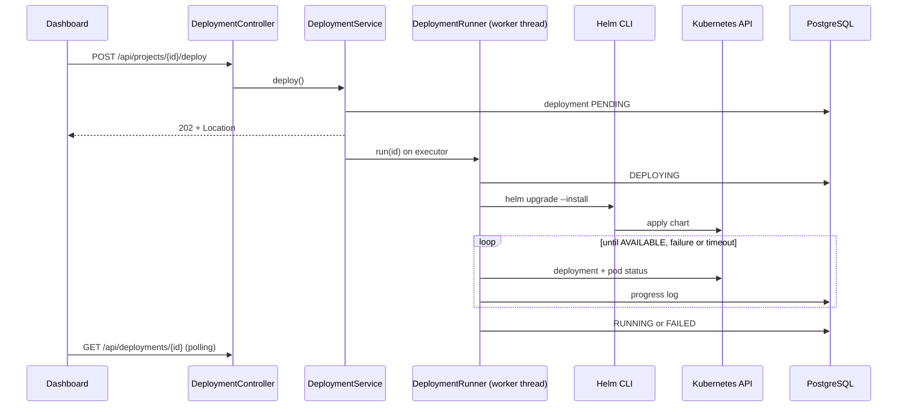
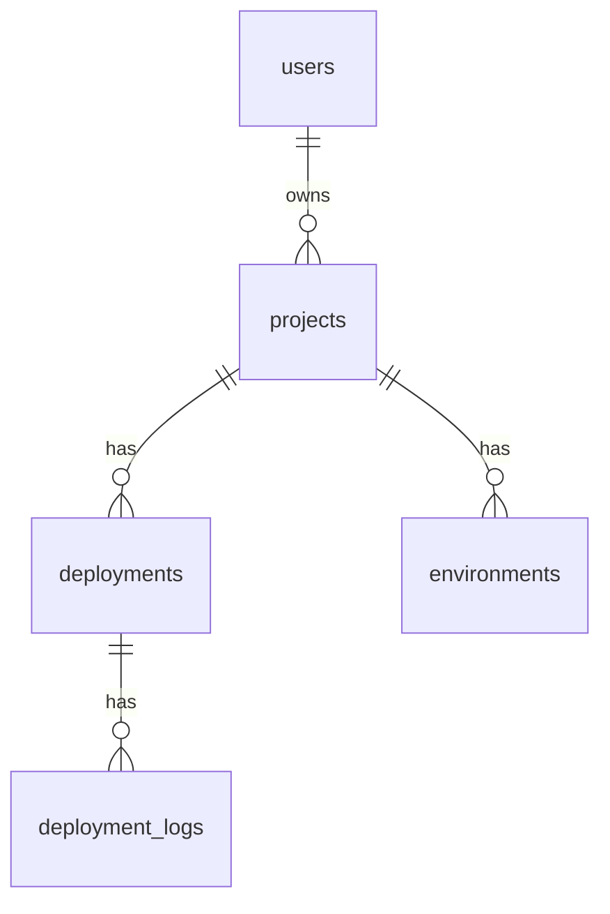

# Architecture

## Backend layers

```mermaid
flowchart TD
    C[controller<br/>HTTP, DTO validation] --> S[service<br/>business logic]
    S --> R[repository<br/>Spring Data JPA]
    R --> D[(PostgreSQL)]
    S --> E[domain<br/>entities, enums]
    C -.-> DTO[dto]
    S -.-> M[mapper]
    X[exception<br/>@RestControllerAdvice] -.-> C
```

- Controllers only translate HTTP to service calls; no business logic.
- DTOs are the API contract; entities never leave the service layer.
- Errors are RFC 7807 `ProblemDetail` (`application/problem+json`), produced in one place.
- Schema is owned by Flyway (`db/migration`); `ddl-auto: validate`.

## Deployment engine



Design decisions: [ADR 0004](adr/0004-async-deployment-engine.md), [ADR 0006](adr/0006-jwt-and-ownership-in-the-service-layer.md).

The `security` package holds the filter chain, JWT encoding/decoding, `CurrentUser` and the login limiter. Services
reach projects and deployments through `ProjectAccess`, which applies the ownership rule. See [security.md](security.md).

## Data model (V1 to V5)



Deployment states: `PENDING, BUILDING, DEPLOYING, RUNNING, FAILED, ROLLED_BACK` (enforced by a check constraint).
V2 adds a partial unique index allowing a single `PENDING`/`BUILDING`/`DEPLOYING` deployment per project.
V3 adds `deployments.version`, a per-project sequence (1, 2, 3, ...) back-filled from `created_at` for existing rows and
unique per project; the history shows it as the deployment's version.
V4 adds `deployments.rollback_of_version`, the version a rollback deployment restores (NULL for regular deployments).
V5 adds `users` (unique case-insensitive email, bcrypt hash, role `USER`/`ADMIN`) and the nullable `projects.owner_id`;
project names become unique per owner instead of globally.

## Frontend

`src/` is feature-oriented: `features/{projects,deployments,logs}` for feature code, with shared `components`,
`pages`, `hooks`, `services` (API calls only), `types` and `lib` (Axios and TanStack Query clients).
Components never call Axios directly; they use hooks that wrap services.

Authentication lives in `features/auth` (`AuthProvider`, `RequireAuth`, `RequireAdmin`) and `lib/authStorage`. The Axios
client adds the bearer token and, on a 401 outside login, ends the session.
