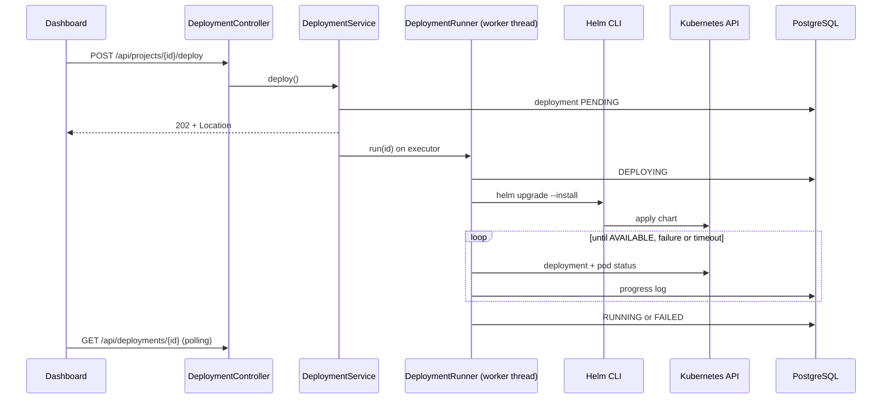
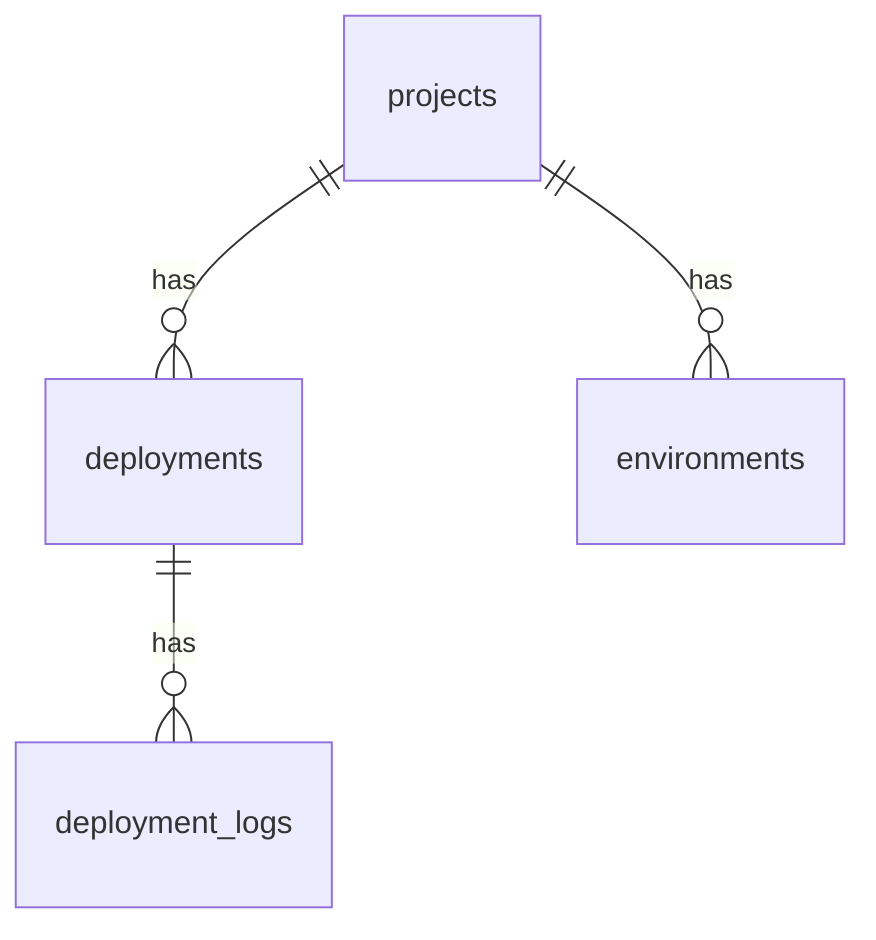

# Architecture

## Backend layers

```mermaid
flowchart TD
    C[controller<br/>HTTP, DTO validation] --> S[service<br/>business logic]
    S --> R[repository<br/>Spring Data JPA]
    R --> D[(PostgreSQL)]
    S --> E[domain<br/>entities, enums]
    C -.-> DTO[dto]
    S -.-> M[mapper]
    X[exception<br/>@RestControllerAdvice] -.-> C
```

- Controllers only translate HTTP to service calls; no business logic.
- DTOs are the API contract; entities never leave the service layer.
- Errors are RFC 7807 `ProblemDetail` (`application/problem+json`), produced in one place.
- Schema is owned by Flyway (`db/migration`); `ddl-auto: validate`.

## Deployment engine



Design decisions: [ADR 0004](adr/0004-async-deployment-engine.md).

## Data model (V1, V2)



Deployment states: `PENDING, BUILDING, DEPLOYING, RUNNING, FAILED, ROLLED_BACK` (enforced by a check constraint).
V2 adds a partial unique index allowing a single `PENDING`/`BUILDING`/`DEPLOYING` deployment per project.

## Frontend

`src/` is feature-oriented: `features/{projects,deployments,logs}` for feature code, with shared `components`,
`pages`, `hooks`, `services` (API calls only), `types` and `lib` (Axios and TanStack Query clients).
Components never call Axios directly; they use hooks that wrap services.
