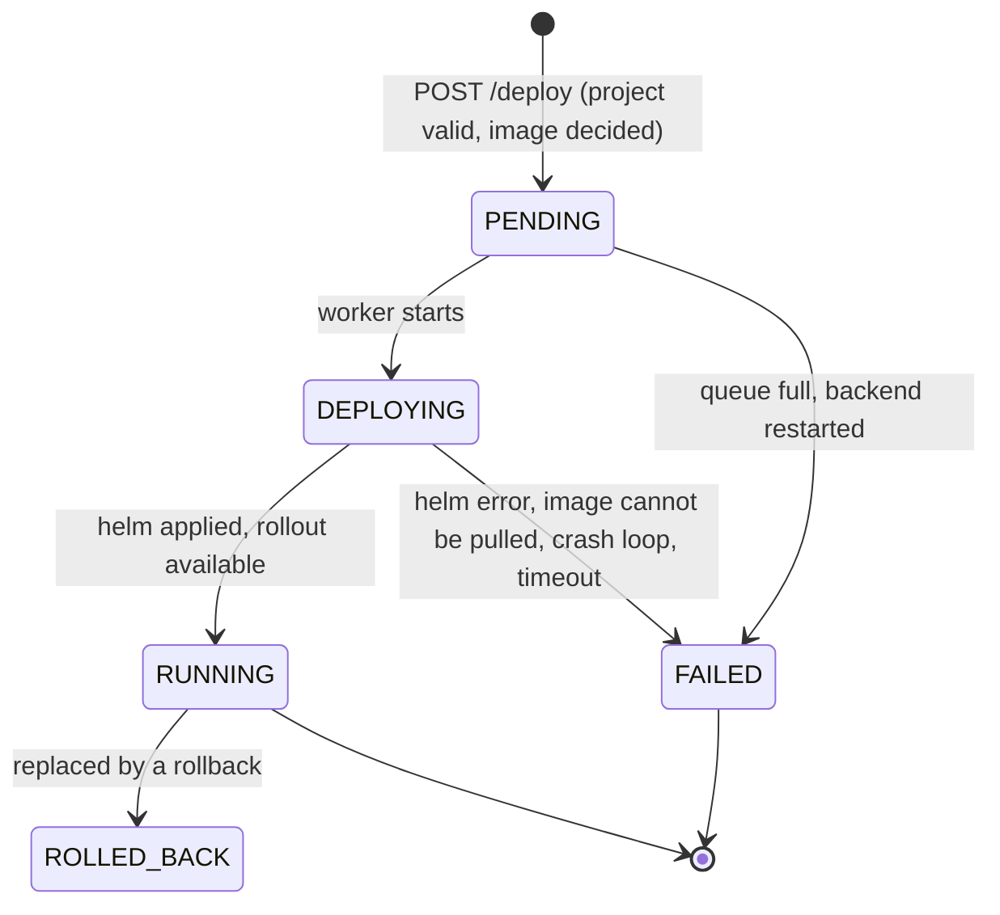

# Deployment engine

How `POST /api/projects/{id}/deploy` turns a project into a running application. The design decisions are in
[ADR 0004](adr/0004-async-deployment-engine.md), the sequence diagram is in [architecture.md](architecture.md), and the
endpoints are in [api.md](api.md).

The request returns immediately (`202`) and a dedicated executor runs the workflow; follow it with
`GET /api/deployments/{id}` (the dashboard polls it).

`BUILDING` exists in the schema but is not produced: images are built by GitHub Actions in the application's own
repository, not by DeployKit. `ROLLED_BACK` marks a deployment that ran successfully and was later undone by a
[rollback](#rollback).

1. **Validate** the project and **decide the image** (request override, otherwise derived from the repository).
2. **Record** a `PENDING` deployment. One deployment per project may be in flight at a time (`409` otherwise,
   enforced by a partial unique index).
3. **Deploy**: create the namespace `dk-<project>-<id>`, then `helm upgrade --install` with the chart in `helm/deploykit-app`.
4. **Monitor the rollout** through the Kubernetes API. A pod stuck in `ImagePullBackOff`, `CrashLoopBackOff`, ... for
   30 s fails the deployment right away instead of waiting for the 5 minute timeout.
5. **Store** every step in `deployment_logs` and set the final status, `started_at`, `finished_at` and `error_message`.

A failed rollout leaves the previous version running (rolling update). On startup, deployments left in flight by a
previous run are marked `FAILED`.

## Rollback

A rollback reuses the same workflow: `POST /api/deployments/{id}/rollback` records a new `PENDING` deployment whose image
is the one of the restored version (`rollback_of_version` remembers which), then the worker runs `helm upgrade --install`
and monitors the rollout like for any deployment. Only the latest deployment can be rolled back, only one deployment
may be in flight per project, and a failed rollback leaves everything as it was. When the rollback succeeds, the
deployments it replaced are marked `ROLLED_BACK` in the same transaction. The rules and error cases are in
[api.md](api.md#rollback), the reasoning in [ADR 0005](adr/0005-rollback-as-a-new-deployment.md).

## Limits

Limits of this phase: the deployment engine assumes a **single backend instance**, and it needs the `helm` binary and
a kubeconfig, so deploy from a backend run natively (see the [quick start](../README.md#quick-start) and
[local-kubernetes.md](local-kubernetes.md)), not from the `full` Docker Compose profile.
Private registries (image pull secrets) are not supported yet.
