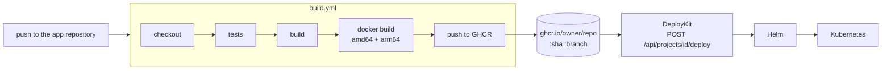

# GitHub Actions: building the images DeployKit deploys

DeployKit does not build images: it deploys them. Each application repository builds its own image with the
reusable pipeline [`.github/workflows/build.yml`](../.github/workflows/build.yml) and publishes it to GitHub
Container Registry (GHCR). DeployKit then deploys the image it expects for that repository.



## Use it in an application repository

The repository needs a `Dockerfile`. Add `.github/workflows/image.yml`:

```yaml
name: Image
on:
  push:
    branches: [main]
jobs:
  image:
    permissions:
      contents: read
      packages: write          # required to push to GHCR
    uses: paul-pti/DeployKit/.github/workflows/build.yml@main
    with:
      java_version: "21"       # optional, for Java projects
      test_command: ./mvnw -B test
      build_command: ./mvnw -B -DskipTests package
```

A Node.js application:

```yaml
    with:
      node_version: "22"
      test_command: npm ci && npm test
      build_command: npm run build
```

Inputs (all optional): `working_directory` (default `.`, also the Docker build context), `dockerfile`
(default `Dockerfile`), `image_suffix`, `test_command`, `build_command`, `java_version`, `node_version`,
`platforms` (default `linux/amd64,linux/arm64`) and `push` (default `true`; use `false` on pull requests).
Outputs: `image`, `sha`, `digest`.

The reusable workflow lives in this repository: if it is private, allow other repositories to use it in
*Settings → Actions → General → Access*. Pin `@main` to a tag or commit SHA for reproducible builds.

## Image names and tags

| Tag | When | Purpose |
|---|---|---|
| `<full commit sha>` | every push | immutable, what a release should deploy |
| `<branch name>` (`/` becomes `-`) | pushes to a branch | what DeployKit deploys when you give it nothing |
| `<git tag>` | pushes of a tag | releases |
| `latest` | default branch only | convenience; never the only tag |

The image name is `ghcr.io/<owner>/<repo>` in lowercase (add `image_suffix` for several images per repository).
DeployKit derives the same name from the project's repository URL, so a project on branch `main` is deployed from
`ghcr.io/<owner>/<repo>:main`, or from `:<sha>` when the deploy request contains `"commitSha"`. Commit-SHA tags are
immutable (`imagePullPolicy: IfNotPresent`), branch tags move and are always re-pulled.

Deploy a specific build:

```bash
curl -X POST localhost:8080/api/projects/<id>/deploy -H 'Content-Type: application/json' \
  -d '{"commitSha": "<full or short sha>"}'
```

## Required GitHub secrets and permissions

| Item | Required | Details |
|---|---|---|
| `GITHUB_TOKEN` | automatic | Created by GitHub for every run, nothing to configure. The calling job must grant `packages: write` (see the example above). |
| `registry_token` | optional | A personal access token with the `write:packages` scope, passed as `secrets: { registry_token: ${{ secrets.GHCR_TOKEN }} }`. Only needed when the automatic token cannot push, for example when the package belongs to another user or organisation, or the organisation restricts workflow permissions. Store it as a repository secret (for example `GHCR_TOKEN`), never in the workflow file. |

No cloud credential is needed for this phase. Pull requests never push (`push: false`), and the token of pull
requests from forks is read-only.

## First run checklist

1. Push a commit and open the *Actions* tab: the run should end with the summary listing the pushed tags.
2. Open the package (*your profile or organisation → Packages*) and check that both `linux/amd64` and
   `linux/arm64` are listed.
3. **Make the package public** (*Package settings → Change visibility*), or the cluster cannot pull it. New GHCR
   packages are private and DeployKit does not support image pull secrets yet.
4. Deploy it from DeployKit.

## Troubleshooting

- **`denied: permission_denied: write_package`**: the calling job lacks `permissions: packages: write`, or the
  package belongs to someone else (use `registry_token`), or the repository is not allowed to write to an existing
  package (*Package settings → Manage Actions access*).
- **`Pod ... is ErrImagePull` in DeployKit**: the package is private, or the tag does not exist yet (wrong branch,
  build still running).
- **`exec format error` in the pod**: the image was not built for the cluster's CPU. The default builds amd64 and
  arm64; check that `platforms` was not narrowed.
- **`mvnw: Permission denied`**: commit the wrapper with its executable bit (`git update-index --chmod=+x mvnw`).
- **Slow first run**: arm64 is built with QEMU emulation; later runs reuse the GitHub Actions layer cache.

## DeployKit's own pipeline

[`.github/workflows/ci.yml`](../.github/workflows/ci.yml) runs on every push to `main`/`develop` and on pull requests:
the backend goes through this same reusable workflow (published as `ghcr.io/<owner>/<repo>-backend`), and two more jobs lint
and build the frontend and lint/render the Helm chart. Actions are pinned to major versions; keep them current with
Dependabot or Renovate.
